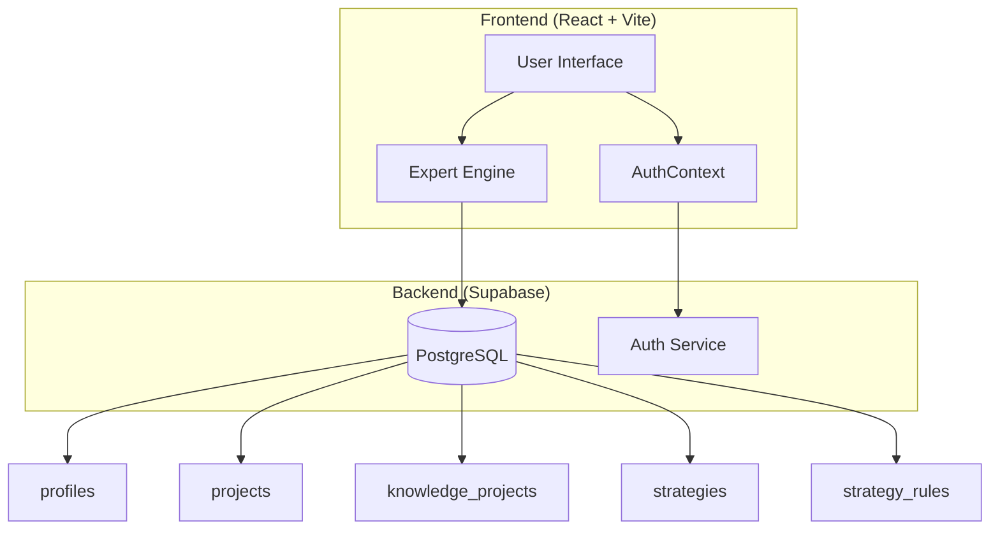
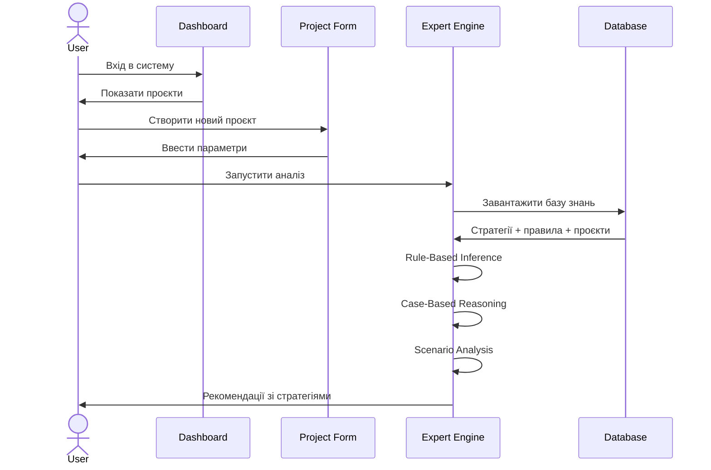
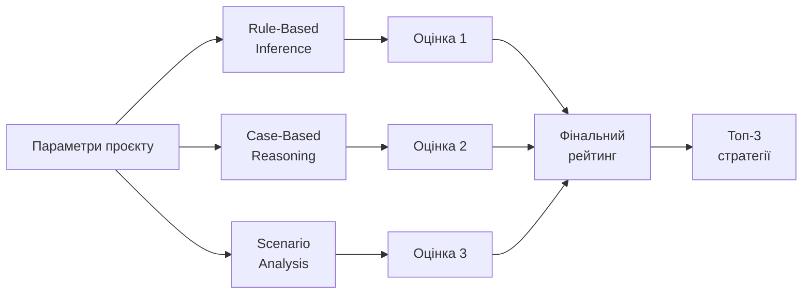
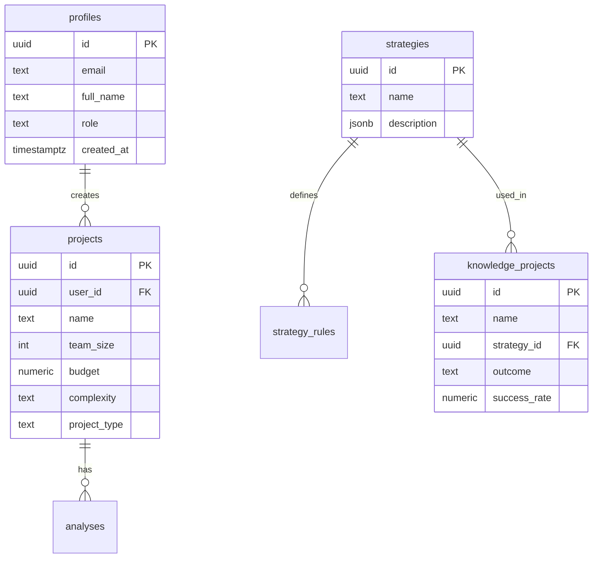

# ExpertPM — Експертна система управління ІТ-проєктами 🚀

[](https://react.dev)
[](https://vitejs.dev)
[](https://supabase.com)
[](LICENSE)

Інтелігентна система підтримки прийняття рішень для менеджерів ІТ-проєктів. Аналізує параметри проєкту та рекомендує оптимальні стратегії управління на основі бази знань та трьох механізмів інференції.

---

## ✨ Особливості

- 🧠 **Три механізми інференції**: Rule-Based, Case-Based Reasoning, Scenario Analysis
- 🌍 **Двомовність**: Українська та англійська (i18next)
- 📱 **Responsive дизайн**: Адаптивний під мобільні пристрої
- 🎨 **Apple-inspired UI**: Мінімалістичний дизайн з glassmorphism
- 👥 **Управління користувачами**: Адмін-панель для керування ролями
- 📊 **База знань**: Перегляд та управління референсними проєктами
- 🔐 **Supabase Auth**: Безпечна автентифікація

---

## 🏗️ Архітектура системи



---

## 🔄 Workflow користувача



---

## 🧠 Як працює вибір стратегії

Система використовує **три механізми** одночасно для максимальної точності:



### 1️⃣ Rule-Based Inference (Правила)

Оцінює кожну стратегію на основі правил:
- **Якщо** складність = висока **І** досвід команди = senior → **Agile** (+15 балів)
- **Якщо** бюджет < $50K **І** термін < 3 міс → **Waterfall** (+10 балів)

### 2️⃣ Case-Based Reasoning (Подібність)

Знаходить схожі проєкти в базі знань:
- Обчислює схожість за 10 параметрами з вагами
- Витягує стратегії успішних проєктів
- Враховує результат (success/partial/failure)

### 3️⃣ Scenario Analysis (Сценарії)

Моделює три сценарії:
- **Оптимістичний**: Все йде за планом
- **Реалістичний**: Типові затримки та проблеми
- **Песимістичний**: Максимальні ризики

---

## 📊 Фактори, що впливають на вибір

| Фактор | Вага | Опис |
|--------|------|------|
| **Складність** | 15% | low / medium / high / critical |
| **Тип проєкту** | 12% | development / support / migration / integration / research |
| **Рівень ризику** | 12% | low / medium / high / critical |
| **Досвід команди** | 10% | junior / mixed / senior / expert |
| **Розмір команди** | 10% | Кількість розробників |
| **Бюджет** | 10% | Фінансові обмеження |
| **Залученість клієнта** | 8% | minimal / moderate / active / embedded |
| **Стабільність вимог** | 8% | stable / evolving / volatile |
| **Тривалість** | 8% | Місяці |
| **Новизна технологій** | 7% | established / moderate / cutting_edge |

### Приклад розрахунку

**Проєкт**: E-commerce платформа
```
Параметри:
- Складність: High (3/4)
- Ризик: Medium (2/4)
- Команда: 8 осіб, Senior
- Бюджет: $150,000
- Термін: 6 місяців
- Технології: React + Node.js (established)

Результат:
✅ Agile + Incremental Delivery (87% впевненості)
✅ Scrum with 2-week sprints (82%)
✅ Kanban with continuous delivery (76%)
```

---

## 🚀 Швидкий старт

### Передумови
- Node.js 18+
- Обліковий запис Supabase

### Встановлення

```bash
# 1. Клонування репозиторію
git clone https://github.com/hrussttt-one/it-expert-system.git
cd it-expert-system

# 2. Встановлення залежностей
npm install

# 3. Налаштування змінних середовища
cp .env.example .env
# Відредагуйте .env та додайте ваші Supabase credentials
```

### Налаштування бази даних

1. Створіть проєкт у [Supabase](https://supabase.com)
2. Відкрийте **SQL Editor** і виконайте:
   ```sql
   -- Створення таблиць
   \i supabase/schema.sql
   
   -- Наповнення бази знань
   \i supabase/seed.sql
   ```

3. **⚠️ Для прототипу**: Вимкніть RLS
   ```sql
   ALTER TABLE profiles DISABLE ROW LEVEL SECURITY;
   ALTER TABLE projects DISABLE ROW LEVEL SECURITY;
   ALTER TABLE analyses DISABLE ROW LEVEL SECURITY;
   ALTER TABLE strategies DISABLE ROW LEVEL SECURITY;
   ALTER TABLE knowledge_projects DISABLE ROW LEVEL SECURITY;
   ALTER TABLE strategy_rules DISABLE ROW LEVEL SECURITY;
   ```

### Запуск

```bash
# Режим розробки
npm run dev

# Production build
npm run build
npm run preview
```

Відкрийте http://localhost:5173

---

## 📁 Структура проєкту

```
it-expert-system/
├── src/
│   ├── components/          # UI компоненти
│   │   ├── Layout.jsx       # Хедер + навігація
│   │   ├── ProtectedRoute.jsx
│   │   ├── AdminRoute.jsx
│   │   └── LanguageSwitcher.jsx
│   ├── contexts/
│   │   └── AuthContext.jsx  # Глобальний стан авторизації
│   ├── i18n/                # Переклади
│   │   ├── uk.json          # 🇺🇦 Українська
│   │   └── en.json          # 🇬🇧 Англійська
│   ├── lib/
│   │   ├── supabase.js      # Supabase клієнт
│   │   └── expertEngine.js  # Механізми інференції
│   ├── pages/
│   │   ├── LoginPage.jsx
│   │   ├── DashboardPage.jsx
│   │   ├── NewProjectPage.jsx
│   │   ├── ProjectDetailPage.jsx
│   │   ├── KnowledgeBasePage.jsx
│   │   └── AdminPage.jsx
│   ├── App.jsx              # Маршрутизація
│   ├── main.jsx
│   └── index.css            # Apple-inspired стилі
├── supabase/
│   ├── schema.sql           # DDL: таблиці, RLS, тригери
│   └── seed.sql             # База знань
└── package.json
```

---

## 🗄️ Схема бази даних



---

## 👥 Ролі користувачів

| Роль | Можливості |
|------|-----------|
| **user** | ✅ Створення проєктів<br/>✅ Запуск аналізу<br/>✅ Перегляд рекомендацій<br/>✅ Перегляд бази знань |
| **admin** | ✅ Все вище +<br/>✅ Управління користувачами<br/>✅ Редагування/видалення з бази знань<br/>✅ Перегляд всіх проєктів |

---

## 🌐 Змінні середовища

```env
VITE_SUPABASE_URL=https://your-project.supabase.co
VITE_SUPABASE_ANON_KEY=your-anon-key-here
```

---

## 📱 Responsive дизайн

Повністю адаптивний під всі пристрої:
- 📱 Мобільні (320px+): Гамбургер-меню, картки замість таблиць
- 📱 Планшети (768px+): Оптимізована сітка
- 💻 Десктоп (1200px+): Повний функціонал

---

## 🎯 Технології

| Категорія | Технологія |
|-----------|-----------|
| **Frontend** | React 19, Vite 7 |
| **Стилі** | Vanilla CSS (Apple-inspired) |
| **Backend** | Supabase (PostgreSQL + Auth) |
| **Інтернаціоналізація** | i18next |
| **Маршрутизація** | React Router DOM 7 |
| **Деплой** | Cloudflare Pages / GitHub Pages |

---

## 📦 Версії

- **v1.0-stable** — Стабільна версія з повним функціоналом
- **GitHub**: [hrussttt-one/it-expert-system](https://github.com/hrussttt-one/it-expert-system)

---

## 📄 Ліцензія

MIT License - дивіться [LICENSE](LICENSE)

---

## 🤝 Контрибуція

Contributions welcome! Відкривайте issues та pull requests.

---

**Створено з ❤️ для оптимізації управління ІТ-проєктами**
